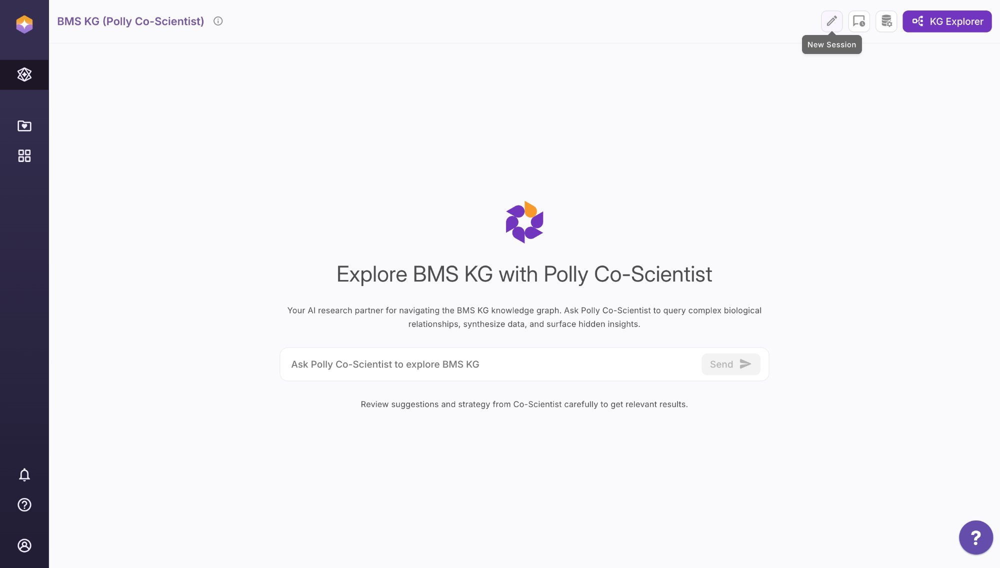

## Overview {#sec-getting-started}

This chapter walks you through logging into the BMS KG platform (Polly Co-Scientist), understanding the workspace layout, and running your first natural-language query. It takes about five minutes.

---

## Accessing the Platform

The BMS Knowledge Graph is hosted on **Polly** (Elucidata's life-sciences data platform) and accessed through a browser — no installation required.

**Login steps:**

```{=html}
<div class="step-box"><div class="step-number">1</div><div>Navigate to your organisation's Polly URL (provided by your Elucidata administrator).</div></div>
<div class="step-box"><div class="step-number">2</div><div>Sign in with your BMS SSO credentials or the email/password provided during onboarding.</div></div>
<div class="step-box"><div class="step-number">3</div><div>From the Polly home screen, locate and open the workspace named <strong>BMS KG (Polly Co-Scientist)</strong>.</div></div>
<div class="step-box"><div class="step-number">4</div><div>The KG chat interface loads automatically. You are ready to query.</div></div>
```

::: {.callout-note}
If you cannot log in or do not see the BMS KG workspace, contact your Elucidata administrator or email [yogesh.lakhotia@elucidata.io](mailto:yogesh.lakhotia@elucidata.io).
:::

---

## The Interface at a Glance

{fig-alt="Screenshot of the BMS KG Polly Co-Scientist interface showing the query bar, New Session button, and KG Explorer button" .lightbox}

The interface has four main areas:

| Area | Location | What it does |
|---|---|---|
| **Left sidebar** | Far left icon strip | Navigation — workspace, files, apps, settings |
| **Query bar** | Centre of screen | Type your natural-language question here and press Send |
| **New Session** | Top right (pencil icon) | Starts a fresh conversation with no prior context |
| **Chat History** | Top right (clock icon) | Browse and resume previous sessions |
| **KG Explorer** | Top right (purple button) | Switch to visual graph exploration mode |

---

## Starting a New Session

Each session maintains its own conversation context. Start a new session when:

- You are switching to a completely different question or molecule
- A previous session has accumulated too much context and responses feel off-track
- You want a clean slate for a structured analysis workflow

```{=html}
<div class="step-box"><div class="step-number">1</div><div>Click the <strong>pencil icon</strong> (New Session) in the top-right toolbar.</div></div>
<div class="step-box"><div class="step-number">2</div><div>The chat area clears. Type your first question in the query bar at the bottom.</div></div>
<div class="step-box"><div class="step-number">3</div><div>Press <strong>Send</strong> (or hit Enter). The Co-Scientist queries the KG and returns results, often with tables, charts, or network views.</div></div>
```

---

## Viewing Chat History

All sessions are automatically saved.

```{=html}
<div class="step-box"><div class="step-number">1</div><div>Click the <strong>clock icon</strong> in the top-right toolbar.</div></div>
<div class="step-box"><div class="step-number">2</div><div>A panel opens showing previous sessions, sorted by date. Click any session to resume it.</div></div>
<div class="step-box"><div class="step-number">3</div><div>You can continue the conversation from where you left off, or start a new session from the resumed view.</div></div>
```

---

## KG Explorer Mode

KG Explorer is a **visual graph browser** — it lets you navigate the knowledge graph as an interactive node-edge network rather than through conversation.

```{=html}
<div class="step-box"><div class="step-number">1</div><div>Click the <strong>KG Explorer</strong> button (top right, purple) at any time.</div></div>
<div class="step-box"><div class="step-number">2</div><div>Search for a gene, protein, metabolite, or pathway by name.</div></div>
<div class="step-box"><div class="step-number">3</div><div>The graph renders showing direct neighbours. Click any node to expand its connections.</div></div>
<div class="step-box"><div class="step-number">4</div><div>Use the filter panel to restrict visible edge types (e.g., show only <code>upregulated</code> or <code>gene_part_of</code> edges).</div></div>
```

::: {.callout-tip}
Use KG Explorer when you want to **visually trace** relationships from a specific gene — for example, following HSPA5 through its WGCNA module, to its enriched pathways, to its TF regulators, all in one graph view.
:::

---

## Exporting a Chat Session

To share your analysis or save results:

```{=html}
<div class="step-box"><div class="step-number">1</div><div>At the end of a session, click the <strong>export icon</strong> in the session toolbar (top right of the chat area).</div></div>
<div class="step-box"><div class="step-number">2</div><div>Choose your format: <strong>PDF</strong> (formatted conversation), <strong>CSV</strong> (tables only), or <strong>JSON</strong> (raw results).</div></div>
<div class="step-box"><div class="step-number">3</div><div>The export downloads to your browser's default downloads folder.</div></div>
```

---

## Your First Query

Once logged in, try this to verify the KG is working and to get an immediate sense of what is available:

::: {.query-box}
What molecules and clones are available in the BMS internal dataset?
:::

A working KG will return a table listing Nivo and C144 clones with their study and productivity group classifications. If you see an error or an empty result, contact your administrator.

---

## Tips Before You Start

- **Be specific about the entity type** — say "gene", "protein", or "metabolite" explicitly
- **Name the cohort or condition** — include molecule (Nivo / C144) and study when relevant  
- **Include thresholds** — e.g., "adj. p-value < 0.05 and |log2FC| > 2"
- **Review suggestions carefully** — Co-Scientist may offer a query strategy before running; check it makes sense before confirming

Full query-writing guidance is in @sec-query-tips.
