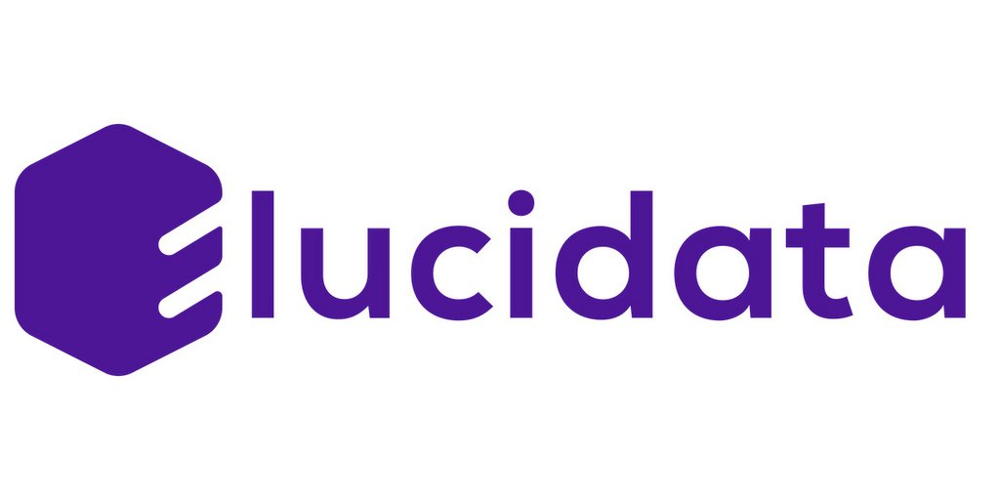

```{=html}
<div class="partner-logos">
  
  <span class="logo-divider"></span>
  
</div>

<div class="hero-banner">
  <p class="hero-title">BMS CHO Cell Productivity<br>Knowledge Graph</p>
  <p class="hero-subtitle">User Manual &nbsp;·&nbsp; Version 3 &nbsp;·&nbsp; March 2026</p>
</div>
```

## About this Manual

This manual is your end-to-end guide for working with the **BMS CHO Cell Productivity Knowledge Graph (KG)**, a multi-omics, multi-evidence platform built to accelerate the identification of genetic engineering targets that improve CHO cell productivity.

The KG integrates:

- **BMS in-house data** — transcriptomics, proteomics, and metabolomics from Study 1 and Study 2 alongside bioprocess readouts (qP, titre, IVCD, lactate, cell density)
- **CHO-specific public omics data** — 13 datasets from 10+ publications comparing high vs. low producers
- **Causal literature evidence** — cause-effect relationships curated from ~290 genetic perturbation publications
- **External databases** — NCBI, UniProt, GO, KEGG, ChEBI, PubMed, Cellosaurus

The bioinformatics analyses embedded in the KG include differential expression / abundance (DEG/DAA), WGCNA co-expression networks, MOFA multi-omics integration, pathway enrichment (GSEA & ORA), and transcription-factor enrichment.

---

## How to Use this Manual

| If you want to | Go to |
|---|---|
| Log in and navigate the interface | @sec-getting-started |
| Understand what the KG contains before querying | @sec-orientation |
| Browse BMS omics data and run DEG / WGCNA / MOFA queries | @sec-internal |
| Look up what published studies say about a gene | @sec-literature |
| Check whether BMS data agrees with published findings | @sec-cross-evidence |
| Test a specific biological hypothesis | @sec-hypothesis |
| Shortlist high-confidence engineering targets | @sec-targets |
| Search, export, or generate plots | @sec-utilities |

---

## Manual Structure

This manual is organised into nine chapters, followed by a glossary of key terms.

```{=html}
<div class="step-box">
  <div class="step-number">1</div>
  <div><strong>Getting Started</strong> — Login, workspace navigation, first query</div>
</div>
<div class="step-box">
  <div class="step-number">2</div>
  <div><strong>Orientation</strong> — KG data model, cohort naming, query tips</div>
</div>
<div class="step-box">
  <div class="step-number">3</div>
  <div><strong>Internal Data Exploration</strong> — DEG, WGCNA, MOFA, pathway enrichment, TF analysis</div>
</div>
<div class="step-box">
  <div class="step-number">4</div>
  <div><strong>Public Literature Evidence</strong> — Published gene-productivity associations</div>
</div>
<div class="step-box">
  <div class="step-number">5</div>
  <div><strong>Cross-Evidence Integration</strong> — Concordance between BMS data and literature</div>
</div>
<div class="step-box">
  <div class="step-number">6</div>
  <div><strong>Hypothesis Testing</strong> — Interrogate the KG with a prior gene, pathway, or mechanism</div>
</div>
<div class="step-box">
  <div class="step-number">7</div>
  <div><strong>Target Prioritisation</strong> — Shortlist overexpression and knockout candidates</div>
</div>
<div class="step-box">
  <div class="step-number">8</div>
  <div><strong>KG Utilities</strong> — Search, cross-reference, export, plot</div>
</div>
```

---

## Key Conventions

::: {.callout-note}
**Query boxes** throughout this manual show verbatim natural-language queries you can type directly into the KG interface. Results may vary slightly depending on cohort or filter settings.
:::

::: {.callout-tip}
**Evidence badges** tag information by analytical layer:

<span class="evidence-badge badge-deg">DEG/DAA</span>
<span class="evidence-badge badge-wgcna">WGCNA</span>
<span class="evidence-badge badge-mofa">MOFA</span>
<span class="evidence-badge badge-lit">Literature</span>
<span class="evidence-badge badge-gem">GEM (in progress)</span>
:::

---

*For support, contact [yogesh.lakhotia@elucidata.io](mailto:yogesh.lakhotia@elucidata.io)*
